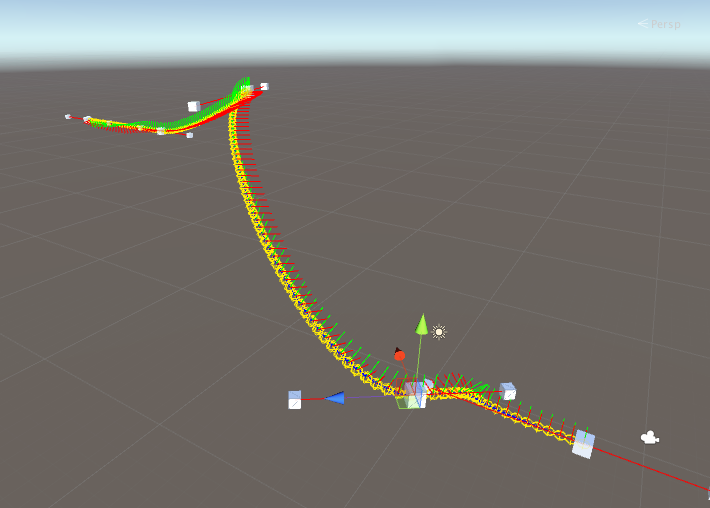

# BezierPath
BezierPath for unity

~~~cs
BezierPath path = new BezierPath (nodes, rots);

// v: 0 - 1
BezierPointInfo pInfo = path.GetBezierPointInfo(v);

/// 

/// Bezier point info.
/// 

public class BezierPointInfo
{
	public Vector3 point;
	public Quaternion rotation;
	public Vector3 tangent;
}
~~~
